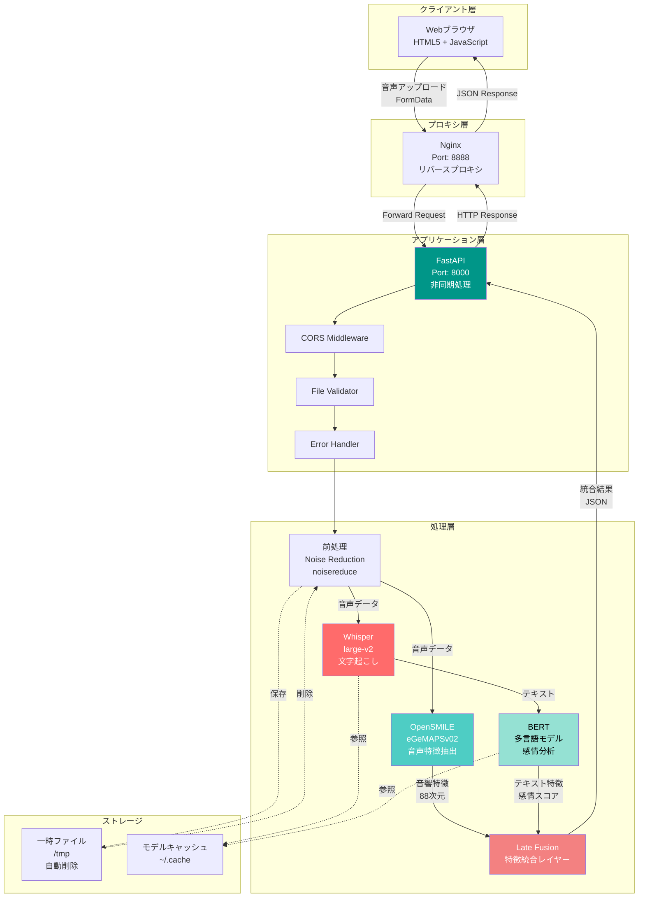
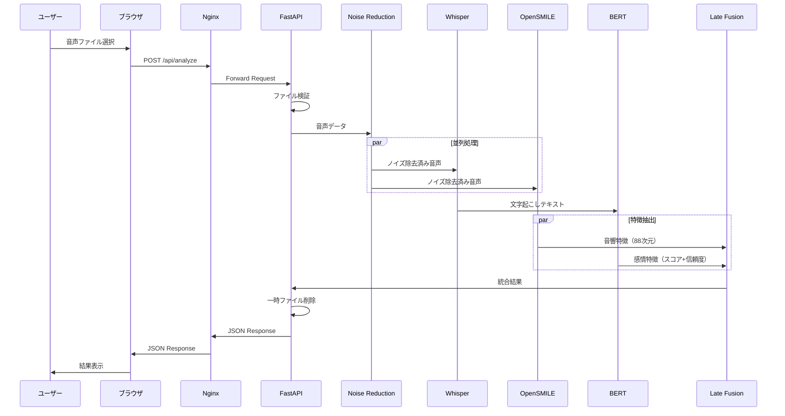
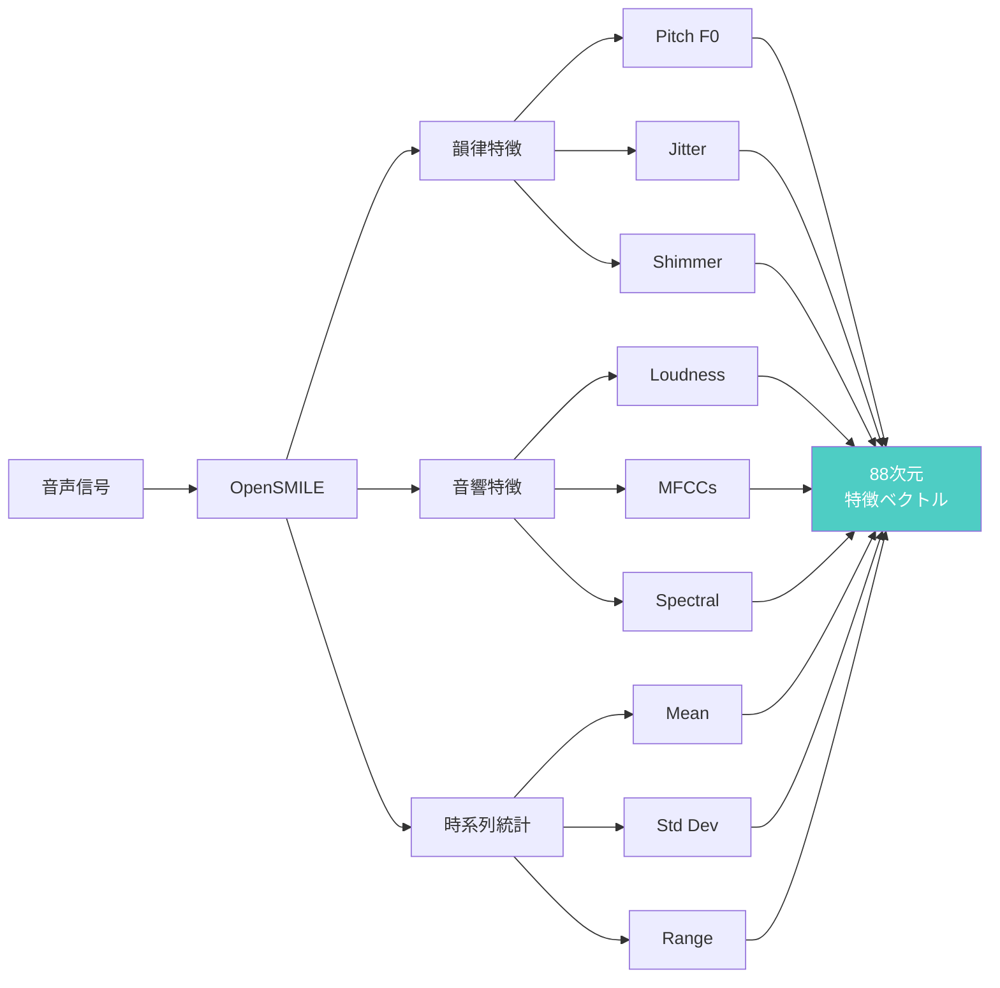
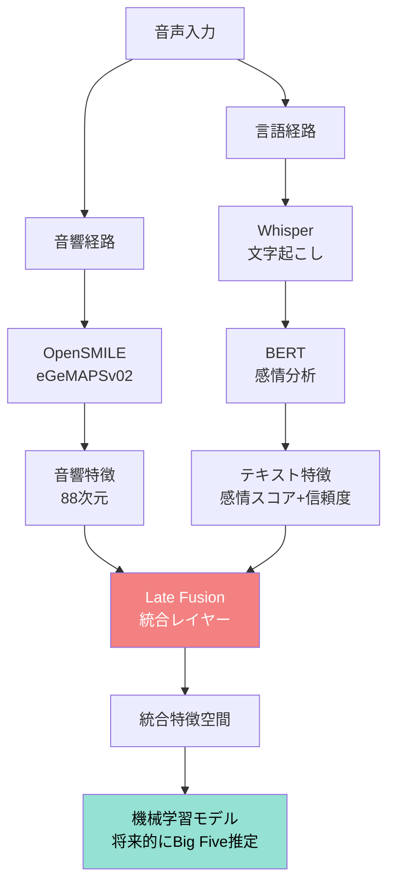
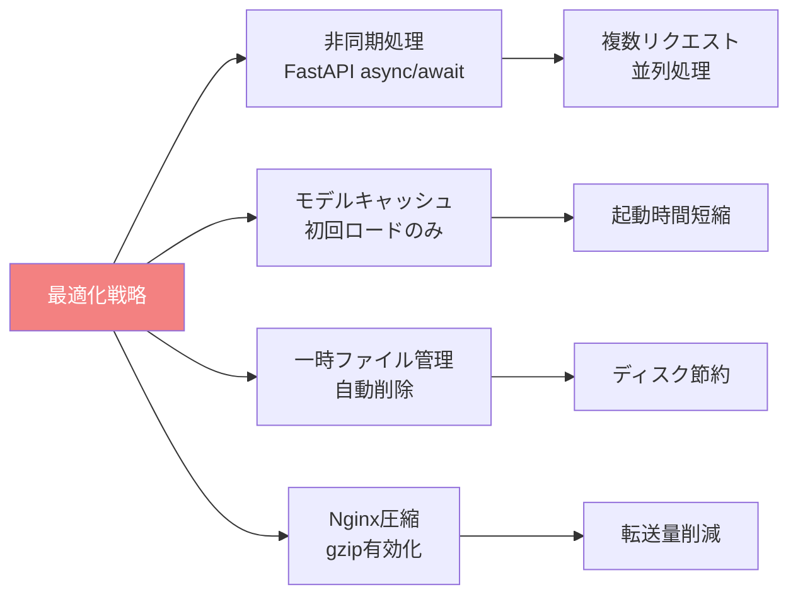
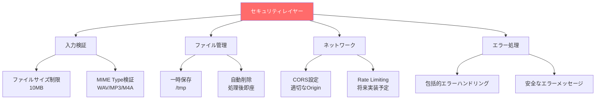

# システムアーキテクチャ詳細図

## 全体アーキテクチャ



## データフロー詳細



## 音声特徴抽出詳細



## Late Fusion戦略



## インフラ構成

```mermaid
graph TB
    subgraph Internet["インターネット"]
        U[ユーザー]
    end
    
    subgraph VPS["VPS Ubuntu 22.04<br/>IP: 162.43.73.18"]
        N[Nginx<br/>Port: 8888]
        
        subgraph Service["Systemd Service"]
            F[FastAPI<br/>Port: 8000<br/>Uvicorn ASGI]
        end
        
        subgraph Python["Python 3.10 venv"]
            W[Whisper]
            O[OpenSMILE]
            B[BERT]
        end
        
        subgraph Storage["ストレージ"]
            T[/tmp/<br/>一時ファイル]
            C[~/.cache/<br/>モデル]
        end
    end
    
    U -->|HTTPS| N
    N -->|Proxy Pass| F
    F --> W
    F --> O
    F --> B
    
    W -.->|読込| C
    B -.->|読込| C
    F -.->|書込/削除| T
    
    style N fill:#269,color:#fff
    style F fill:#096,color:#fff
```

## 技術スタック詳細

| レイヤー | 技術 | バージョン | 役割 |
|---------|------|-----------|------|
| **Frontend** | HTML5 + JavaScript | - | UI/UX |
| **Proxy** | Nginx | 1.18+ | リバースプロキシ、静的ファイル配信 |
| **Backend** | FastAPI | 0.104+ | Web APIフレームワーク |
| **ASGI Server** | Uvicorn | 0.24+ | 非同期サーバー |
| **音声認識** | OpenAI Whisper | large-v2 | 多言語文字起こし |
| **音響特徴** | OpenSMILE | 3.0+ (eGeMAPSv02) | 88次元特徴抽出 |
| **感情分析** | BERT | 多言語 | テキスト感情分類 |
| **音声処理** | librosa | 0.10+ | 音声読込・変換 |
| **ノイズ除去** | noisereduce | 3.0+ | 前処理 |
| **OS** | Ubuntu | 22.04 | サーバーOS |
| **Service Management** | systemd | - | プロセス管理 |

## パフォーマンス最適化



## セキュリティ対策



---

## 図の使い方

これらの図は以下の用途で使用できます：

1. **README.mdに埋め込む** - Mermaidは自動レンダリングされます
2. **ドキュメント作成** - 技術仕様書や設計書に使用
3. **プレゼンテーション** - 応募時のポートフォリオ説明に活用
4. **PNG/SVGエクスポート** - Mermaid Live Editorでエクスポート可能

### Mermaid Live Editor
https://mermaid.live/

上記URLで図をコピペして、PNG/SVG形式でダウンロードできます。
