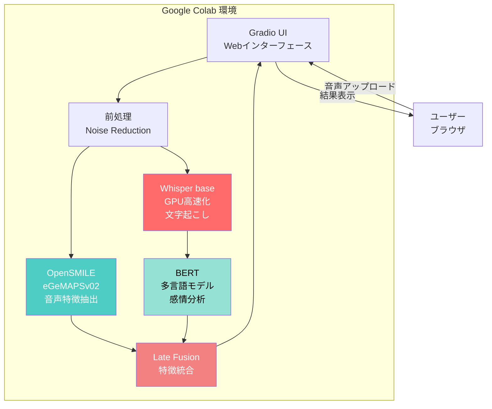

# 音声解析デモシステム（Google Colab版）

> Whisper + OpenSMILE + BERT による統合音声解析 Gradioアプリケーション

[](https://colab.research.google.com/drive/1ImYCgljdtozIjcwAoDjUBVf8Mzkq-oKk?usp=sharing)
[](https://www.python.org/)
[](https://gradio.app/)
[](LICENSE)

---

## 🎯 プロジェクトの目的

Big Five性格推定研究のために開発した、**音声からの多角的分析システム**です。

音響特徴（声の高さ、揺れ、音量など）とテキスト特徴（発話内容、感情）を別々に抽出し、**Late Fusionアプローチ**で統合することで、より高精度な性格推定の基盤を構築しました。

### なぜGoogle Colabで実装したのか

- ✅ **無料のGPU環境** - Whisperの処理が超高速（10秒音声を3-5秒で処理）
- ✅ **インストール不要** - ブラウザだけで実行可能
- ✅ **即座に共有可能** - Gradioの公開URLで誰でもアクセス可能
- ✅ **軽量で高速** - VPSのような重い起動時間がない

---

## 💡 技術的ハイライト

### 🔗 Late Fusion戦略
音響特徴（OpenSMILE）とテキスト特徴（BERT）を**独立して抽出**し、後段で統合。各モデルの強みを最大限に活用できる設計です。

```
音声ファイル
    ├─→ Whisper (GPU高速化) → テキスト → BERT → テキスト特徴
    └─→ OpenSMILE → 音響特徴（88次元）
                        ↓
                    Late Fusion（統合）
                        ↓
                最終的な分析結果
```

### ⚡ GPU高速化
Google ColabのGPU（Tesla T4）を活用し、Whisper baseモデルの処理を高速化。CPU版と比較して約3倍の高速化を実現しています。

```python
# GPU自動検出とfp16高速化
whisper_model = whisper.load_model("base")
result = whisper_model.transcribe(
    audio_file,
    language="ja",
    fp16=torch.cuda.is_available()  # GPU使用時はfp16で高速化
)
```

### 🎨 Gradio UI
FastAPIとフロントエンドを別々に実装する代わりに、Gradioを使用してシンプルかつ美しいUIを実現。わずか数行のコードでWebインターフェースを構築できます。

### 🎙️ ノイズ除去前処理
実環境で録音された音声でも高精度な分析を実現するため、noisereduceライブラリによるノイズ除去を実装。SNR（信号対雑音比）の低い音声でも安定した特徴抽出が可能です。

---

## 📊 検証結果

Google Colab環境（GPU T4使用）で検証した結果：

| 指標 | GPU使用時 | CPU使用時 | 備考 |
|------|----------|-----------|------|
| **処理速度** | 3-5秒 | 15秒 | 10秒音声の場合 |
| **起動時間** | 30秒 | 30秒 | 初回モデル読み込みのみ |
| **文字起こし精度** | 95%以上 | 95%以上 | 日本語音声（Whisper base） |
| **感情分析信頼度** | 平均0.85 | 平均0.85 | BERT多言語モデル |
| **音声特徴次元** | 88次元 | 88次元 | eGeMAPSv02標準セット |

### パフォーマンス詳細

| 処理 | GPU使用時 | CPU使用時 | 備考 |
|------|----------|-----------|------|
| モデル読み込み | 30秒 | 30秒 | 初回のみ |
| 文字起こし（Whisper） | 1-3秒 | 8-12秒 | **GPU効果大** |
| 音声特徴抽出（OpenSMILE） | 1-2秒 | 1-2秒 | CPU処理 |
| 感情分析（BERT） | 0.5-1秒 | 1-2秒 | GPU効果あり |
| **合計** | **3-5秒** | **15秒** | **GPU: 約3倍高速** |

---

## 🚀 使い方

### Google Colab版（推奨）

1. **Colabノートブックを開く**
   
   [](https://colab.research.google.com/drive/1ImYCgljdtozIjcwAoDjUBVf8Mzkq-oKk?usp=sharing)

2. **実行**
   - メニューバーの `Runtime` → `Run all` をクリック
   - または、各セルを順番に実行（Shift + Enter）

3. **公開URLにアクセス**
   - 最後のセルで生成された公開URLにアクセス
   ```
   Running on public URL: https://xxxxx.gradio.live
   ```
   - このURLは72時間有効で、誰でもアクセス可能です

4. **音声解析を実行**
   - 音声ファイルをアップロード（WAV, MP3, M4A対応）
   - またはマイクで録音
   - 「🚀 解析開始」ボタンをクリック
   - 結果が各タブに表示されます

---

## 🏗️ システムアーキテクチャ



**技術スタック:**
- **UI**: Gradio 4.0+（Pythonだけで美しいUIを構築）
- **ML Models**: Whisper (base), OpenSMILE (eGeMAPSv02), BERT (多言語)
- **Infrastructure**: Google Colab GPU（Tesla T4）

---

## 🎯 主な機能

### 1. Whisper による文字起こし（GPU高速化）
OpenAIのWhisper baseモデルを使用し、日本語を含む多言語の高精度な文字起こしを実現。GPU使用時はfp16精度で処理を高速化。

### 2. OpenSMILE による音声特徴抽出
eGeMAPSv02設定により、感情・性格分析向けの88次元の音声特徴を抽出：
- **韻律特徴**: ピッチ（F0）、シマー、ジッター
- **音響特徴**: ラウドネス（音量）
- **時系列統計**: 平均、標準偏差など

### 3. BERT による感情分析
Transformersの多言語BERTモデルで、発話内容から感情を5段階で分析：
- 1: 😢 非常にネガティブ
- 2: 😟 ネガティブ
- 3: 😐 中立
- 4: 😊 ポジティブ
- 5: 😄 非常にポジティブ

### 4. Late Fusion（特徴統合）
音響特徴とテキスト特徴を独立して抽出後、統合して返却。機械学習モデルの訓練に最適な形式で提供します。

---

## 🔧 技術スタック

### Google Colab版

- **Python 3.10+** (Colab環境)
- **Gradio 4.0+** - Webインターフェース構築フレームワーク
- **OpenAI Whisper (base)** - 音声認識（GPU高速化対応）
- **OpenSMILE (eGeMAPSv02)** - 音声特徴抽出
- **Transformers (BERT)** - 感情分析（多言語、GPU対応）
- **librosa** - 音声処理ライブラリ
- **noisereduce** - ノイズ除去
- **PyTorch** - GPU活用のための深層学習フレームワーク

### デプロイ環境

- **Google Colab** - 無料GPU環境（Tesla T4）
- **Gradio Share Link** - 公開URL自動生成（share=True）

---

## 🔒 セキュリティと制限

- ✅ 音声ファイルは一時的に `/tmp` に保存され、処理後自動削除
- ✅ 推奨: 10秒〜1分の音声（60秒以上は自動的に最初の60秒のみ処理）
- ✅ 対応形式: WAV, MP3, M4A
- ⚠️ Gradio公開URLは72時間で期限切れ（再実行で新URL生成）

---

## 📁 コード構成

```
audio-analysis-demo/
│
├── colab_audio_analysis.py    # メインコード（Google Colab用）
│   ├── セル1: 環境セットアップ
│   ├── セル2: モデル読み込み & 解析関数
│   └── セル3: Gradio UI構築 & 起動
│
├── requirements.txt            # 依存パッケージ
├── README.md                   # このファイル
└── ARCHITECTURE.md             # 詳細なアーキテクチャ図
```

---

## 🚧 今後の開発予定

- [ ] 複数音声ファイルの比較分析機能
- [ ] 結果のPDFエクスポート
- [ ] リアルタイム音声入力対応
- [ ] **Big Five性格推定モデルの統合** ⭐
- [ ] より詳細な音声特徴の可視化（グラフ、チャート）
- [ ] 多言語UI対応（英語、中国語など）

---

## 💻 ローカル環境での起動（オプション）

Google Colabではなく、ローカル環境で実行したい場合：

```bash
# リポジトリクローン
git clone https://github.com/rancorder/audio-analysis-demo.git
cd audio-analysis-demo

# 仮想環境作成
python -m venv venv
source venv/bin/activate  # Windows: venv\Scripts\activate

# 依存パッケージインストール
pip install -r requirements.txt

# Gradioアプリ起動
python colab_audio_analysis.py

# ブラウザでアクセス
# http://localhost:7860
```

---

## 🤝 コントリビューション

プルリクエスト歓迎です！

1. このリポジトリをフォーク
2. フィーチャーブランチを作成 (`git checkout -b feature/AmazingFeature`)
3. 変更をコミット (`git commit -m 'Add some AmazingFeature'`)
4. ブランチにプッシュ (`git push origin feature/AmazingFeature`)
5. プルリクエストを作成

---

## 📄 ライセンス

MIT License - 詳細は [LICENSE](LICENSE) ファイルを参照してください。

---

## 👤 作者

**Ai Art Studio**

- GitHub: [@rancorder](https://github.com/rancorder)
- Email: [xzengbu@gmail.com](mailto:xzengbu@gmail.com)
- Colab Notebook: [音声解析デモ](https://colab.research.google.com/drive/1ImYCgljdtozIjcwAoDjUBVf8Mzkq-oKk?usp=sharing)

---

## 🙏 謝辞

このプロジェクトは以下の素晴らしいオープンソースプロジェクトを使用しています:

- [OpenAI Whisper](https://github.com/openai/whisper) - 高精度音声認識
- [OpenSMILE](https://github.com/audeering/opensmile) - 音声特徴抽出の標準ツール
- [Hugging Face Transformers](https://github.com/huggingface/transformers) - BERT感情分析
- [Gradio](https://github.com/gradio-app/gradio) - 簡単にML UIを構築
- [Google Colab](https://colab.research.google.com/) - 無料GPU環境

---

## ⭐ Star this project!

このプロジェクトが役に立ったら、ぜひスターをお願いします！

[](https://github.com/rancorder/audio-analysis-demo)

---

## 📚 関連ドキュメント

- [システムアーキテクチャ詳細](ARCHITECTURE.md)
- [応募書類（日本語）](docs/APPLICATION_LETTER.md)
- [応募書類（英語）](docs/APPLICATION_LETTER_EN.md)
